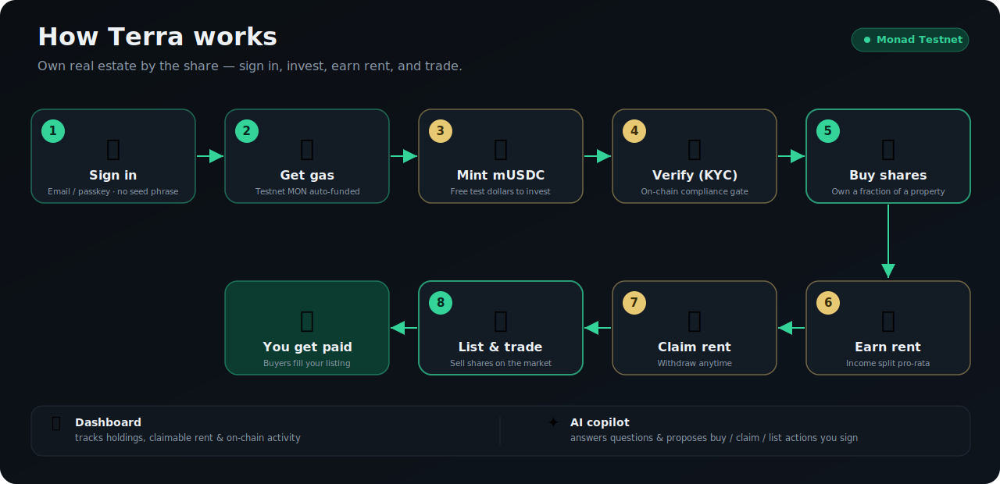

# 🏠 Terra — Tokenized Real Estate on Monad

**Own a fraction of real estate. Earn the rent. Trade anytime.**

Terra turns a property into thousands of on-chain shares. Instead of needing
₹1 crore to buy a flat, you can buy a few shares for a few dollars, receive your
slice of the rental income, and sell your shares whenever you want — all settled
on **Monad**.

> 🏆 Monad Blitz Mumbai submission. Built with the `monskill` stack.
> _Demo / testnet only — not investment advice._

---

## 🔗 Live on Monad Testnet

Everything is deployed and verified on Monad testnet (chain id **10143**).

| Contract | Address |
|----------|---------|
| ComplianceRegistry | `0x61E3b60A0Ed2Ea3afA4170b9d54c52915f3AE06C` |
| MockUSDC (mUSDC) | `0x19DC796A7ecD01E798bd00920a5b96f872C82d57` |
| PropertyShares | `0x61d3eFc64FBC0070418A925d5cfFC318B3B8983a` |
| Marketplace | `0xacAC85fD3bCDa4b74CfFdB114701590A47D49705` |

Explorer: **https://testnet.monadexplorer.com** · RPC: `https://testnet-rpc.monad.xyz`

---

## 👤 The user flow (what actually happens)

This is the whole journey, start to finish. Each step maps to a real on-chain
action — and each has a manual test case in
[docs/testing/core-investing-flow-test-plan.md](docs/testing/core-investing-flow-test-plan.md).

<p align="center">
  
</p>

| # | Step | What happens | Where |
|---|------|--------------|-------|
| 1 | **Sign in** | Email / passkey / social via **Para** → you get an embedded wallet, no seed phrase. (External wallets like MetaMask/Rabby also work.) | Header → *Sign in* |
| 2 | **Get gas** | A new wallet is **auto-funded with testnet MON** for gas on first connect — no manual faucet hunting. | automatic (or *Faucet*) |
| 3 | **Mint mUSDC** | Click once to mint **10,000 mock USDC** — the money you invest with. | *Faucet* |
| 4 | **Verify identity** | Complete **KYC** (individual) or **KYB** (business). This is **enforced on-chain** — you can't own shares without it. | *Verify* |
| 5 | **Buy shares** | Pick a property, buy shares from the primary sale. mUSDC goes to the issuer, shares come to you. | *Marketplace → property → Invest* |
| 6 | **Earn rent** | The property issuer deposits rental income; it's split across all shareholders automatically (pro-rata). | issuer action |
| 7 | **Claim rent** | Withdraw your accrued rent whenever you like (gas-safe pull model). | *Dashboard / property → Claim* |
| 8 | **Trade** | List your shares at a price; any verified buyer can fill (full or partial). Cancel anytime. | *property → Sell shares* |
| 9 | **Track** | See your portfolio value, claimable rent, active listings, and a feed of your on-chain transactions (with explorer links). | *Dashboard* |
| 10 | **Ask the copilot** | A Claude AI assistant answers questions about your portfolio and can **propose** buy/claim/list actions you confirm and sign. | ✦ button |

> 💡 **Common gotcha:** minting mUSDC gives you *money*, not *shares*. You must
> **buy** shares first; only then does the **Sell shares / Approve & List**
> option appear. And buying requires being **KYC-verified**.

---

## ✨ Features

- **Fractional ownership** — each property is an ERC-1155 token with a fixed
  share supply.
- **Rental income** — gas-safe pull-based dividends; claim your share anytime.
- **Secondary marketplace** — escrow-less fixed-price listings with partial fills.
- **On-chain KYC/KYB compliance** — share ownership is gated at the token level.
- **Seedless onboarding** — Para embedded wallets (email/passkey) + auto gas drip.
- **AI investing copilot** — Claude-powered, reads your real on-chain state.
- **Investor dashboard** — holdings, claimable rent, listings, activity feed.

---

## 🏗️ How it works

| Layer | Tech |
|-------|------|
| Smart contracts | Solidity + Foundry + OpenZeppelin → Monad testnet |
| Frontend | Next.js 16 (App Router) + Wagmi v3 + viem + Tailwind v4 |
| Off-chain backend | Next.js API routes → Neon Postgres (falls back to a static seed) |
| Auth | Para (embedded MPC wallets) |
| AI | Anthropic Claude (`claude-opus-4-8`) |
| Hosting | Vercel (web) · Neon (DB) · Monad testnet (contracts) |

### Smart contracts

- **MockUSDC** — ERC-20 test stablecoin (6 decimals) with a public `faucet()`.
- **PropertyShares** — ERC-1155, one token id per property. Rent is distributed
  via an `accRentPerShare` accumulator; `_update` is overridden to checkpoint
  rent on every transfer (so trading never strands or double-pays rent) **and**
  to enforce the compliance gate (only verified addresses can receive shares).
- **Marketplace** — escrow-less fixed-price listings; shares stay in the
  seller's wallet (approved via `setApprovalForAll`) and move directly
  seller → buyer on fill.
- **ComplianceRegistry** — ERC-3643-style allowlist of KYC/KYB-verified
  addresses, written by a backend `VERIFIER` role.

✅ **33 Foundry tests** cover supply caps, rent math, rent conservation across
transfers, compliance gating, and marketplace fills/cancels.

### Project structure

```
contracts/   Foundry — MockUSDC, PropertyShares, Marketplace, ComplianceRegistry (+ tests)
web/         Next.js app — UI pages, API routes, AI copilot
docs/        Design specs + the QA test plan
```

---

## 🚀 Run it locally

The contracts are already deployed, so you only need the web app:

```bash
cd web
cp .env.example .env.local     # fill in the values below
npm install
npm run dev
```

Open **http://localhost:3000**, click **Sign in**, then follow the user flow above.

Minimum `web/.env.local` to talk to the live deployment:

```bash
NEXT_PUBLIC_COMPLIANCE_REGISTRY_ADDRESS=0x61E3b60A0Ed2Ea3afA4170b9d54c52915f3AE06C
NEXT_PUBLIC_MOCK_USDC_ADDRESS=0x19DC796A7ecD01E798bd00920a5b96f872C82d57
NEXT_PUBLIC_PROPERTY_SHARES_ADDRESS=0x61d3eFc64FBC0070418A925d5cfFC318B3B8983a
NEXT_PUBLIC_MARKETPLACE_ADDRESS=0xacAC85fD3bCDa4b74CfFdB114701590A47D49705
NEXT_PUBLIC_MONAD_TESTNET_RPC_URL=https://testnet-rpc.monad.xyz
VERIFIER_PRIVATE_KEY=<key with VERIFIER_ROLE, funded with MON>   # enables KYC writes + gas drip
NEXT_PUBLIC_PARA_API_KEY=<para public key>                       # enables email/passkey sign-in
# optional:
NEXT_PUBLIC_WALLETCONNECT_PROJECT_ID=<reown project id>          # external-wallet connect
ANTHROPIC_API_KEY=<anthropic key>                                # enables the AI copilot
DATABASE_URL=<neon postgres url>                                 # persists issuer-created properties
BRALE_API_KEY=<brale key>                                        # swaps mock KYC → Brale
```

### Configuration reference

| Var | Required? | Purpose |
|-----|-----------|---------|
| `NEXT_PUBLIC_*_ADDRESS` (×4) | ✅ | Deployed contract addresses |
| `VERIFIER_PRIVATE_KEY` | ✅ for KYC | Server signer with `VERIFIER_ROLE`, funded with MON. Also powers the gas drip. |
| `NEXT_PUBLIC_PARA_API_KEY` | recommended | Email/passkey/social sign-in. Without it: injected-wallet connect. |
| `NEXT_PUBLIC_MONAD_TESTNET_RPC_URL` | optional | RPC (defaults to the public endpoint) |
| `NEXT_PUBLIC_WALLETCONNECT_PROJECT_ID` | optional | External-wallet connect (free at cloud.reown.com) |
| `ANTHROPIC_API_KEY` | optional | AI copilot (server-only) |
| `DATABASE_URL` | optional | Neon Postgres; app uses a static seed without it |
| `BRALE_API_KEY` | optional | Real KYC via Brale instead of the mock provider |

> Anything marked optional degrades gracefully — the app still runs, the feature
> just shows a friendly "not configured" state.

---

## 🛠️ Deploy from scratch (optional)

Already deployed — only needed if you want your own instance.

```bash
# 1. Test the contracts
cd contracts && forge test

# 2. Deploy to Monad testnet (needs a key funded with MON)
export MONAD_TESTNET_RPC_URL=https://testnet-rpc.monad.xyz
forge script script/Deploy.s.sol \
  --rpc-url $MONAD_TESTNET_RPC_URL --broadcast --private-key $PRIVATE_KEY
# prints all 4 addresses + seeds 3 demo properties + verifies the deployer

# 3. Verify on the explorers (one API call per contract) — see monskill scaffold skill
# 4. Put the 4 addresses + VERIFIER_PRIVATE_KEY into web/.env.local
```

The deployer becomes the contract **owner**, the property **issuer**, and the
KYC **verifier** — use that same key as `VERIFIER_PRIVATE_KEY`.

### Deploy the web app

Import `web/` into **Vercel**, set the env vars above (add a Neon integration
for `DATABASE_URL`). The Next.js API routes deploy as serverless functions — no
separate backend to run.

---

## 🔐 Notable design choices

- **Compliance is on-chain, not just UI.** `PropertyShares._update` calls the
  ComplianceRegistry, so an unverified address can't receive shares even by
  calling the contract directly. Claiming rent and exiting (selling) stay open.
  The KYC provider is pluggable (`lib/kyc/provider.ts`) — mock by default,
  Brale-ready, and TransFi/Banxa/zerohash can slot in.
- **No gas friction.** New wallets are auto-topped-up with testnet MON via
  `/api/gas/drip` (swap the faucet for a paymaster in production).
- **The AI agent never holds keys.** It reads on-chain state and *proposes*
  actions; you confirm and sign each one in your own wallet.
- **Graceful degradation everywhere.** Para, the database, the copilot, and
  WalletConnect are all optional — the app runs without any of them.

---

## ✅ Testing

- **Automated:** `cd contracts && forge test` (33 passing tests).
- **Manual end-to-end:** follow
  [docs/testing/core-investing-flow-test-plan.md](docs/testing/core-investing-flow-test-plan.md)
  — a step-by-step QA checklist for the full browser flow.

---

## 🗺️ Roadmap

- Envio HyperIndex for a global, cross-device activity feed
- IPFS pinning for property metadata + images
- Permissioned multi-issuer support
- Cross-chain funding (bring USDC onto Monad via a bridge)
